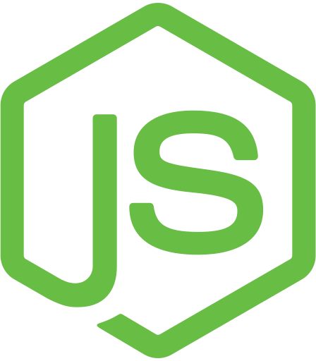
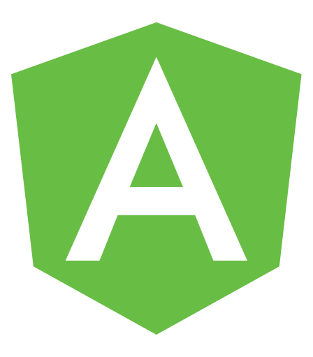

<h1 align="center">Lucas Rosa 👨🏻‍💻 - Welcome to my Github Profile!</h1>

    
    
  

## About me

> I am passionate about technology, innovation, and self-improvement. Currently working as a Java Engineer in an innovative company that uses high-end technology such as microservices, messaging to produce highly scalable, and modular software aiming to solve complex problems. Previously working with workforce optimization software, improving products, helping on the development of new features, and implementing automation tests. Also, an experienced front-end developer working with Angular stack in a Revenue Management project.

## Main Technologies

  
  
  
  
  
  
  
  
  

